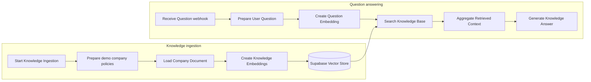
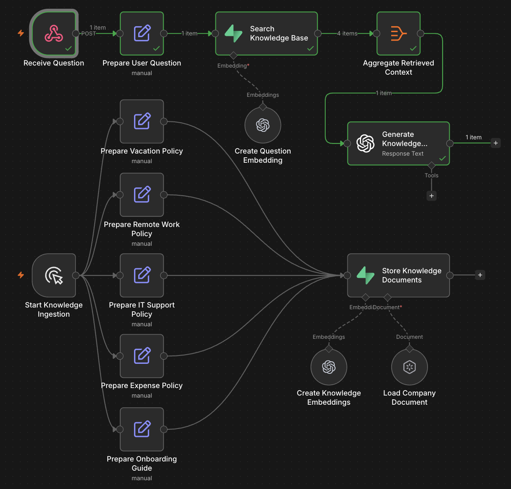
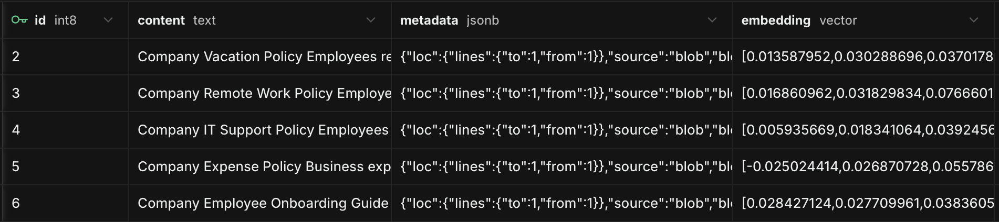
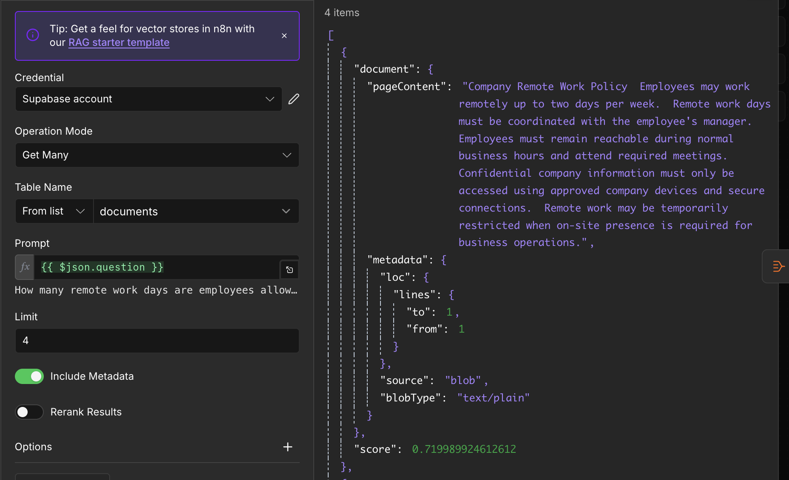
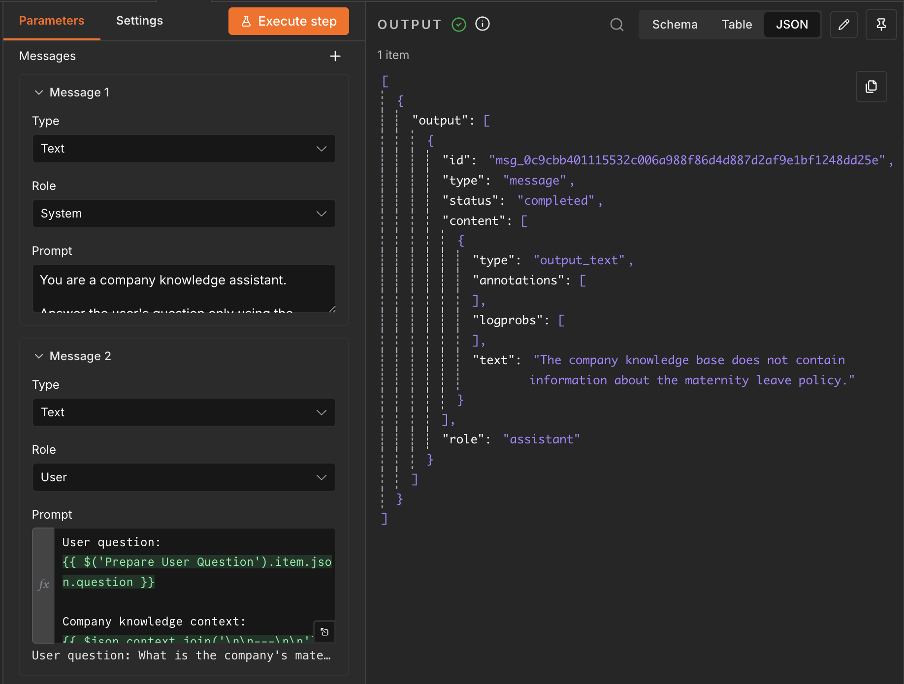

# AI Company Knowledge Assistant - RAG

A RAG-based company knowledge assistant built with n8n. It ingests demo company policies into a Supabase vector store, retrieves relevant context with semantic search, and generates grounded answers with OpenAI. When the answer is not present in the knowledge base, it explicitly says so instead of inventing a policy.

## Business Problem

Internal policies and operating procedures are often scattered across documents and difficult to search quickly. Employees need dependable answers without manually reading through files or relying on guesswork.

## Solution

This workflow separates knowledge ingestion from question answering. Demo policy documents are embedded and stored in Supabase; a user question is embedded, matched against the stored knowledge, and answered using the retrieved context only.

## Key Features

- Semantic search across company knowledge
- Supabase pgvector vector storage
- OpenAI embeddings for documents and questions
- Multi-document retrieval and context aggregation
- Grounded OpenAI answers
- No-hallucination fallback when knowledge is unavailable
- Separate ingestion and question-answering flows
- Webhook-based question input

## Architecture



## Workflow



The workflow has an ingestion path for policy documents and a retrieval path for employee questions.

## Knowledge Base



Supabase stores demo document content, metadata, and vector embeddings in a `documents` table. The demo knowledge base contains fictional Vacation, Remote Work, IT Support, Expense, and Employee Onboarding policies.

## Semantic Search



The assistant converts the question into an embedding and uses vector search to find the most relevant company documents, including their similarity scores.

## Context Aggregation

Retrieved document content is aggregated before generation. This gives the model one grounded context and keeps the answer generation step focused on the most relevant knowledge.

## Example Answer


The example asks about a stolen company laptop. The answer follows the fictional IT Support Policy: report a lost or stolen company device to IT immediately.

## Hallucination Protection



The maternity-leave question is not covered by the demo policies. The assistant responds that the information was not found in the company knowledge base rather than fabricating a policy.

## Tech Stack

| Technology | Role |
| --- | --- |
| n8n | Workflow orchestration |
| OpenAI | Grounded answer generation |
| OpenAI Embeddings | Vector representations for documents and questions |
| Supabase | Managed data platform and vector store |
| PostgreSQL / pgvector | Vector persistence and similarity search |
| Webhooks / JSON | Question input and structured workflow data |

## How It Works

1. Run the manual ingestion branch to prepare the five fictional policy documents.
2. Each document is loaded, embedded with OpenAI, and stored in the Supabase vector store.
3. Send a `POST` request to the workflow webhook with a `question` field.
4. The workflow embeds the question and searches for related documents.
5. It aggregates the retrieved context and asks OpenAI for a concise answer based only on that context.

## Setup

1. Import [workflow/ai-company-knowledge-rag.json](workflow/ai-company-knowledge-rag.json) into n8n.
2. Configure an OpenAI credential for the embeddings and answer-generation nodes.
3. Create a Supabase project with PostgreSQL and the `pgvector` / vector extension enabled.
4. Create or select a `documents` table compatible with the n8n Supabase Vector Store node.
5. Configure a Supabase credential in n8n and select it in the vector-store nodes.
6. Run the knowledge-ingestion branch to load the demo policies.
7. Activate or test the workflow, then send a webhook request containing `question` in the request body.

Credentials are deliberately not included in the export. Configure them through **n8n Credentials** after import.

## Repository Structure

```text
.
├── images/
│   ├── workflow-overview.png
│   ├── knowledge-base-supabase.png
│   ├── semantic-search.png
│   ├── rag-answer.png
│   └── no-hallucination-response.png
├── workflow/
│   └── ai-company-knowledge-rag.json
├── LICENSE
├── README.md
└── .gitignore
```

## Security

- No API keys, Supabase secrets, credential IDs, webhook IDs, instance IDs, or local paths are included in this repository.
- Configure credentials only inside your n8n instance.
- The included policies are fictional demo/sample content, not confidential company data.

## Limitations and Future Improvements

This is a portfolio demo, not a production-ready knowledge platform. Potential improvements include:

- Ingestion from real PDF, Google Drive, Notion, or SharePoint documents
- Automatic document synchronization
- Metadata filtering and source citations
- Role-based access control
- Reranking, evaluation, and monitoring
- A chat UI and conversation memory

## Use Cases

- HR policy assistant
- IT helpdesk knowledge assistant
- Employee onboarding assistant
- Internal SOP search
- Company documentation assistant

## License

Released under the [MIT License](LICENSE).
